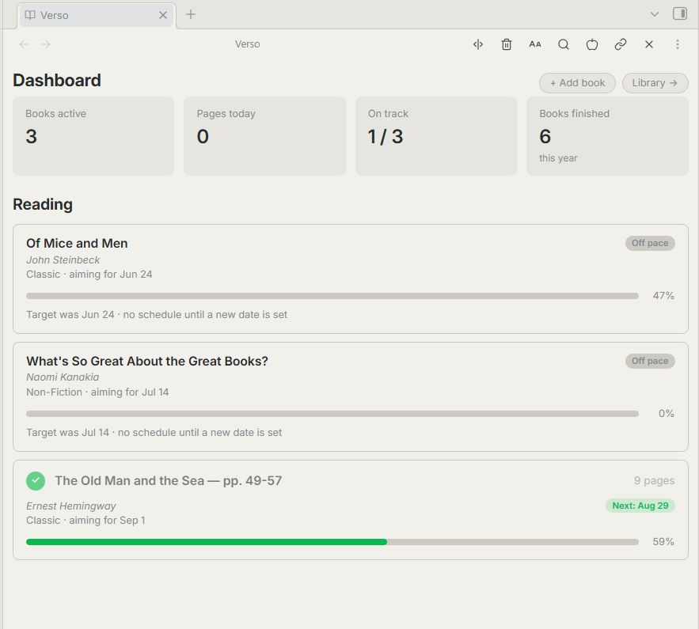
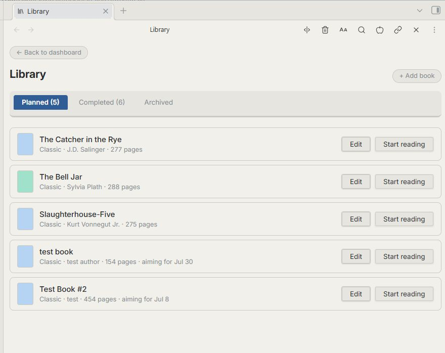
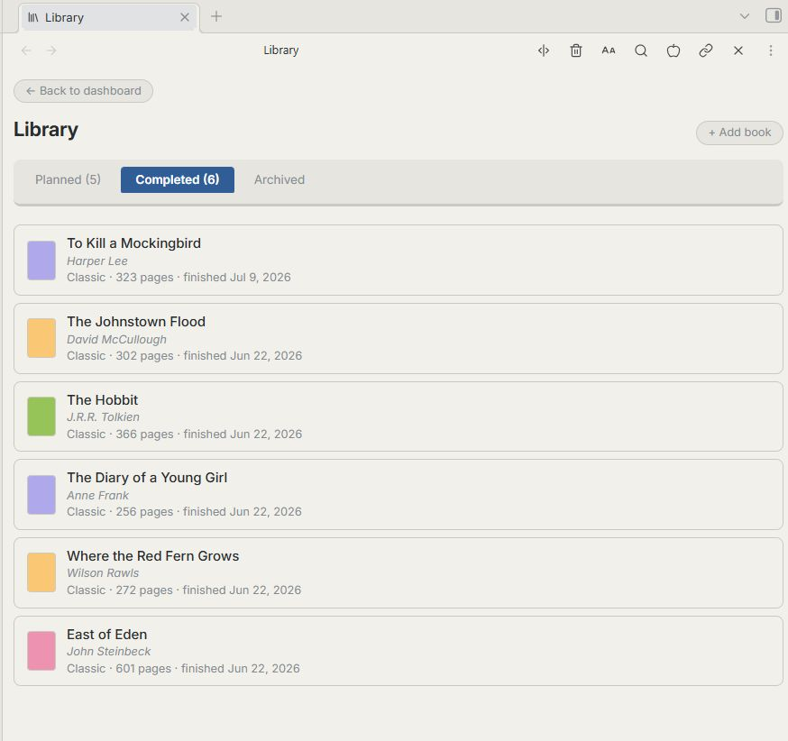
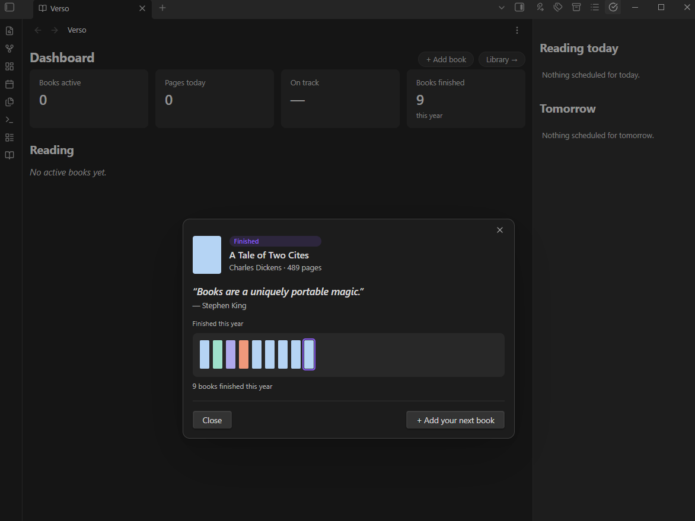
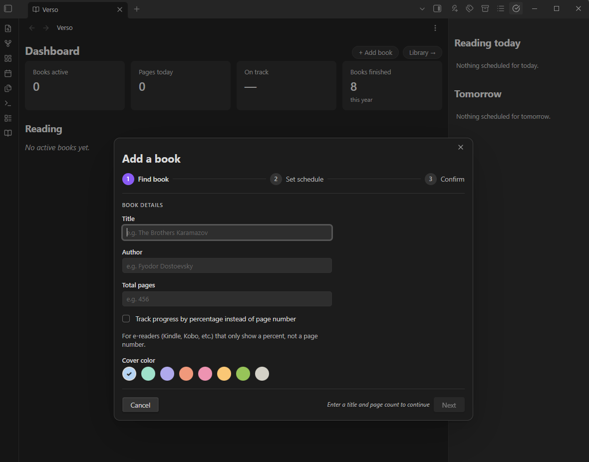

# Verso

**Your reading life, scheduled.**

Verso is a reading scheduler for Obsidian that helps you build realistic reading schedules and stay on pace — without the guilt trips. It tells you where you actually are, not where you wish you were.

---

## What it does

You add a book, set a target finish date, and tell Verso which days you read. It builds a schedule, tracks your daily chunks, and gives you an honest picture of your progress.

If you fall behind, it doesn't spiral into shame math — it redistributes your remaining pages across your remaining days and tells you what you need to do. If you catch up, it clears the "Behind" badge immediately. No streaks, no points, no coaching.

---

## Features

### Dashboard
Your active reading, at a glance. Books are sorted by urgency: off-pace first, then at-risk, then behind, then on-track by due date, then not yet started. Each book shows its status, today's reading chunk, and progress toward completion.

### Today sidebar
A compact reading reminder that lives in your sidebar. Shows just the books with something due today — click to mark a chunk complete without leaving your notes.

### Library
Tabs for your Planned, Completed, and Archived books. Finished books get shelved — literally: their spines line up on a visual bookshelf, sorted by when you finished them. Archived books remember why they were set aside and can be restored whenever you're ready to pick them back up.

 
 

### Honest scheduling
When you log what you actually read — more or less than the plan — Verso updates your schedule around reality, not the original numbers. Catch up or fall behind, the math always starts from where you actually are. Backdated start dates, missed days, and catch-up sessions all resolve cleanly.

If a book's target date passes entirely, Verso doesn't keep inventing a new plan around a date that's already gone. It marks the book **Off pace**, stops scheduling, and waits — your progress stays exactly as it was, with nothing new to check off until you set a new target date. Once you do, it picks up from where you actually are, not from page one.

### Book completion celebration
When you finish a book, Verso marks the moment with a quote about reading — a different one each time, drawn from a larger set for longer books. It also tells you honestly whether you moved your finish date along the way, and lines your finished book up on a shelf with everything else you've read this year. No inflated praise — just the truth, warmly delivered.

### Pages or percent
Reading on a Kindle, Kobo, or another e-reader that only shows percentages? Track that book by percent instead of page numbers. Set it per book when you add or edit it — the scheduling math works exactly the same either way.

### Customizable vocabulary
Reading for a book club? Tracking a project? Working through a subject? Call your collections whatever fits your situation — Projects, Lists, Shelves, Classes, or your own word. The label propagates throughout the interface so it always feels like yours.

### Flexible reading days
Set your default reading days globally (every day, weekdays only, or custom), then override per book as needed.

---

## Philosophy

Verso is a thoughtful friend, not a productivity app. It won't gamify your reading or pretend you're "crushing it" when you're three weeks behind. It will tell you the truth, do the math, and get out of your way.

It's built for independent readers and book clubs — people who read for their own reasons, on their own terms.

---

## Installation

### From the Community Plugins directory
1. Open Obsidian → Settings → Community Plugins
2. Search for **Verso**
3. Install and enable

### Manual installation
1. Download `main.js`, `styles.css`, and `manifest.json` from the [latest release](../../releases/latest)
2. Create a folder called `verso` inside your vault's `.obsidian/plugins/` directory
3. Place the three files inside it
4. Enable the plugin in Settings → Community Plugins

---

## Getting started

1. Open the Verso Dashboard from the ribbon or via the command palette (`Verso: Open Dashboard`)
2. Click **Add a book**
3. Enter the title, author, and page count
4. Set your start date, target finish date, and reading days
5. Verso builds your schedule — start reading

---

## Compatibility

- Obsidian 1.13.1 or later
- Desktop and mobile

Mobile support is new as of 1.3.0 and has been tested on Android. One rough
edge worth knowing about: when you tap into a field in one of the shorter
windows — logging progress, or setting dates when starting a book — the
on-screen keyboard may cover it. The field still works; you just can't see it
while typing. This is a longstanding Obsidian Mobile behavior that affects
many plugins, and it's [been raised with
Obsidian](https://forum.obsidian.md/t/mobile-shrink-modal-height-on-typing-to-accomodate-the-keyboard/117408).

---

## License

[MIT](https://github.com/LiveAQuietLife/obsidian-verso/blob/main/LICENSE)
